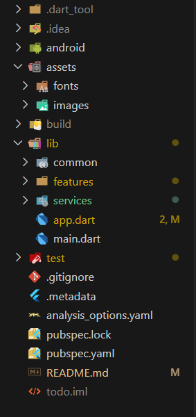

# Aplicativo Mobile de Consulta de Cotações 
Este repositório contém o desenvolvimento de um aplicativo mobile simples para consulta de cotações financeiras em tempo real, feito como parte de um desafio técnico.
## Motivação e Pesquisa Inicial

Antes de iniciar o desenvolvimento, foquei em estudar e pesquisar diversos tópicos que pudessem me ajudar a cumprir os objetivos propostos no desafio técnico. 

- Exemplos de layout de aplicativos de finanças
- Boas práticas de UI/UX para apps de consulta
- Como utilizar ferramentas e metodos  para construção de interfaces e consumo de APIs

A ideia foi seguir a linha de raciocicio que a trilha de aprendizado semanal exemplificava, cobrindo os principais fundamentos de desenvolvimento com Flutter e Dart:

- Configuração do ambiente: Estudei como instalar e configurar o Flutter e o Dart corretamente, além de preparar o projeto no GitHub.

- Lógica com Dart: Busquei conhecer como ultilizaria as variáveis, funções e coleções, para processar os dados recebidos da API.

- Widgets e Layouts: Explorei os widgets básicos do Flutter, como Text, ListView, Button, Row e Column, para estruturar as telas do aplicativo. 

- Navegação e Gerenciamento de Estado: Implementei a navegação entre telas.

- Integração com API: Utilizei o pacote http para consumir uma API pública de cotações e fazer o parse do JSON. 

## Funcionalidades

- Consulta de cotações em tempo real via API

- Interface intuitiva

- Exibição das principais moedas

## Tecnologias Utilizadas

- Flutter
- Dart
- HTTP (pacote para consumo de API)

## Ideação
Durante a fase de ideação, pesquisei diversas referências de layouts de aplicativos financeiros para me inspirar e criar uma interface que fosse não só funcional, mas também bonita e intuitiva para o usuário. Essas referências ajudaram a guiar minhas escolhas de design e layout, apesar de nao ter um resultado muito profissional essas foram as minhas inspirações:

## Estrutura do Projeto
A estrutura deste projeto foi organizada de forma simples e clara para facilitar meu aprendizado com Flutter, já que era minha primeira experiência com a tecnologia. Essa organização me ajudou a entender melhor cada parte do desenvolvimento, desde os estilos visuais até a comunicação com a API, permitindo que eu acompanhasse e explicasse o processo com mais segurança.

## Como rodar o projeto

1. Clone o repositório  
2. Execute `flutter pub get` para instalar as dependências  
3. Use `flutter run` para rodar no emulador ou dispositivo físico  

## 

Referência de estudo, documentação do Flutter
[online documentation](https://docs.flutter.dev/)